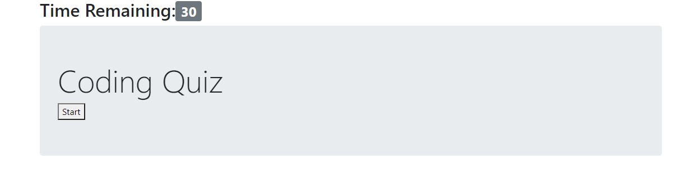

# coding-quiz

## Purpose
This quiz is created to test what I have learned within HTML, CSS and Javascript.
 
## Functionality
It should function with the following:

GIVEN I am taking a code quiz
WHEN I click the start button
THEN a timer starts and I am presented with a question
WHEN I answer a question
THEN I am presented with another question
WHEN I answer a question incorrectly
THEN time is subtracted from the clock
WHEN all questions are answered or the timer reaches 0
THEN the game is over
WHEN the game is over
THEN I can save my initials and score

## Snapshot

## Going forward

### Links
https://github.com/irvingjem/coding-quiz - Repository  
https://irvingjem.github.io/coding-quiz/ - Live Site

Made by me!